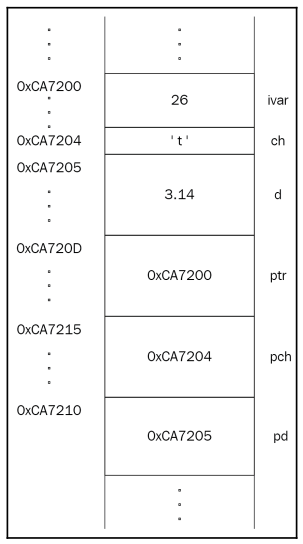

# 3D C++

This are the codes and project files from the book: C++ Game Development by example.

# About

This repo contains all the code from the book described above. The philosophy that i follow is to present the code every chapter as a separate unit of learning. Also i will try to update the C++ syntax to the lastest language standar (Currently C++20). I will write essential concepts that i consider important to note.

## Chapter One: C++ Concepts
This chapter presents the preliminary concepts about the language, from declaring variables to structs and pointers.

### Pointers

> A pointer is just a variable that is able to store address values and supports the * operator (dereferencing), allowing us to find the actual value stored at the address.

Syntax: 
```
& for accesing memory address.
* for getting the actual value stored in memory
------------------------------------------------
int* ptr = &ivar;
char* pch = &ch;
double* pd = &d;
```
Memory layout:




## Running needs

1. [Bazel](https://bazel.build/) as a building tool


## Reference

> GRIGORYAN, V. W. (2020). MASTERING C++ PROGRAMMING: Become an expert programmer by learning coding best practices ... with c++17 and c++20's latest features. Place of publication not identified: PACKT Publishing Limited.