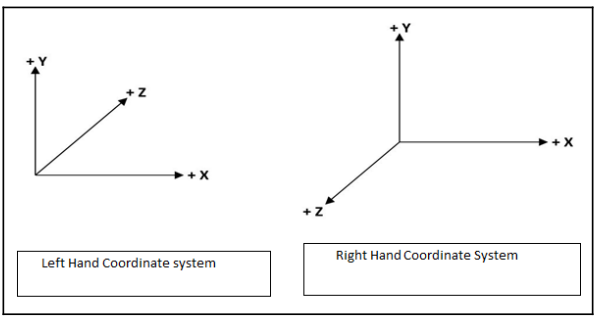

# 3D C++

These are the source codes and project files from the book: C++ Game Development by example by Siddaharth Shekar

# About

This repo contains all the code from the book described above. The philosophy that i follow is to present the code every chapter as a separate unit of learning. Also i will try to update the C++ syntax to the lastest language standar (Currently C++20). I will write essential concepts that i consider important to note.

## Chapter One: C++ Concepts
This chapter presents the preliminary concepts about the language, from declaring variables to structs and pointers.

### Pointers

> A pointer is just a variable that is able to store address values and supports the * operator (dereferencing), allowing us to find the actual value stored at the address.

Syntax: 
```
& for accesing memory address.
* for getting the actual value stored in memory
------------------------------------------------
int* ptr = &ivar;
char* pch = &ch;
double* pd = &d;
```
Memory layout:


## Chapter Two: Mathematics and Graphics concepts
In this chapter is essential that you are familiar with the math that will be used for the projects in later chapters.

### 3D Coordinate systems

>If the positive Z axis moves into the screen, it is called a Left Hand Coordinate System. If the positive Z axis comes out of the screen, then it is called Right Hand Coordinate System.

Open out your right arm with the palm facing towards you and make a fist. Extend the thumb to the right, and extend the index finger upwards. Now extend the middle finger
which faces towards you. This is the right hand coordinate system.

The thumb represents the direction of the positive X axis, the index finger represents the direction of the positive Y axis and the middle finger is the direction of the positive Z axis.
OpenGL, Vulkan or any graphics framework that use them also use this coordinate system.

For the left-hand coordinate system, extend your left arm out with the palm of the hand facing away from you and make a fist. Next extend the thumb and index finger in the right and upwards direction. Now extend the middle finger away from you. In this case, the thumb also represents the direction of the X axis and the index finger is pointing in the direction of the positive Y axis which faces in the right and upwards direction. The Z axis (which is the middle finger) is now facing away from you. This is the Left Hand Coordinate System. Direct3D of DirectX uses this coordinate system.



Since we are going to be covering OpenGL and Vulkan, we will be using
the Right Hand Coordinate System:

## Running needs

1. [Bazel](https://bazel.build/) as a building tool


## Reference

> GRIGORYAN, V. W. (2020). MASTERING C++ PROGRAMMING: Become an expert programmer by learning coding best practices ... with c++17 and c++20's latest features. Place of publication not identified: PACKT Publishing Limited.